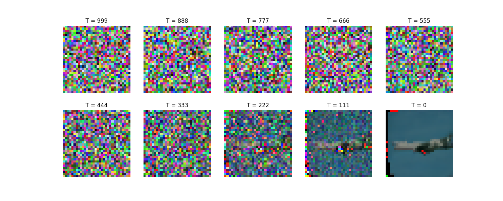
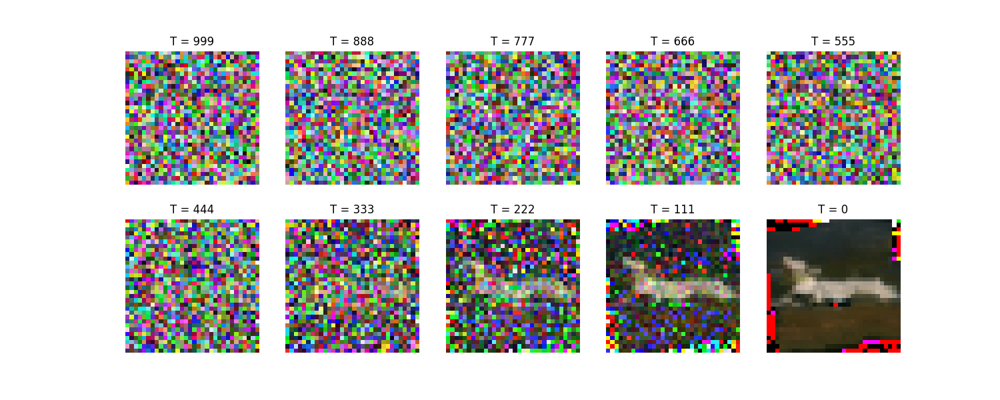

# 🎨 Diffusion2 - Minimal Diffusion Model Implementation

A clean, educational implementation of a **diffusion-based generative model** from scratch, featuring training, sampling, and a FastAPI REST API for inference.

8 -2 - 26 Right now Diffusion is not Diffusing

15 - 03- 26 Now its atleast diffusing ha ha ha 
---

## 📋 Table of Contents

- [Features](#-features)
- [Project Structure](#-project-structure)
- [Quick Start](#-quick-start)
- [Installation](#-installation)
- [Usage](#-usage)
  - [Training](#training-the-model)
  - [Sampling](#sampling-generation)
  - [API Server](#serving-via-fastapi)
- [Configuration](#%EF%B8%8F-configuration)
- [Architecture](#-architecture)
- [Dependencies](#-dependencies)

---


# Some Samples




## ✨ Features

✅ **From-Scratch Implementation** – UNet-based diffusion model without third-party frameworks  
✅ **YAML Configuration** – Centralized, tunable training & model hyperparameters  
✅ **FastAPI Integration** – RESTful API endpoint for image generation  
✅ **Docker Support** – Containerized deployment ready  
✅ **Caltech-101 Dataset** – Pre-configured for object image training  
✅ **GPU/CPU Aware** – Automatic device detection and fallback  
✅ **Modular Architecture** – Clean separation of config, model, diffusion, and utilities  

---

## 📁 Project Structure

```
Diffusion2/
├── 📄 README.md                    # This file
├── 📄 main.py                      # Entry point for CLI modes (train, sample, serve)
├── 📄 train_collab.ipynb           # notebook for experimentation
├── 📄 pyproject.toml               # Project metadata & dependencies
├── 🐳 Dockerfile                   # Container image definition
├── 📦 .python-version              # Python version spec (3.x)
├── 📦 .venv/                       # Virtual environment (gitignored)
├── 📂 build/                       # build outputs (wheel, egg-info)
├── 📂 diffusion2.egg-info/         # package metadata (top-level)
│
├── 📂 app/
│   └── app.py                      # FastAPI application & HTTP endpoints
│
├── 📂 configs/
│   └── base.yaml                   # Hyperparameters & model config (YAML)
│
├── 📂 data/
│   └── plane/                      # local plane images for Dataset
│
├── 📂 Dataset/
│   ├── __init__.py
│   └── plane.py                    # custom dataset loader
│
├── 📂 Logger/
│   ├── __init__.py
│   └── logger.py                   # logging helper
│
├── 📂 logs/
│   ├── inference-logs/
│   └── train-logs/
│
├── 📂 saves/                       # trained model checkpoints
├── 📂 scripts/
│   └── temp.ipynb                 # miscellaneous script
│
├── 📂 src/                         # installable source package
│   ├── diffusion2.egg-info/        # package metadata within src
│   ├── 📂 mini_diffusion/          # Core diffusion model package
│   │   ├── __init__.py
│   │   ├── config.py               # Config loader & Pydantic models
│   │   ├── diffusion.py            # Diffusion process (noise scheduling)
│   │   ├── model.py                # UNet architecture with time embeddings
│   │   ├── preprocessing.py        # image transforms
│   │   ├── train.py                # Training loop
│   │   ├── sample.py               # Sampling/inference function
│   │   └── __pycache__/
│   │
│   └── 📂 argparsers/              # CLI argument parsers (extensible)
│       ├── __init__.py
│       ├── train_parser.py
│       └── inference_parser.py
│
├── 📂 tests/                        # Unit tests (currently empty)
└── 📂 data/plane/                   # dataset images
```

---

## 🚀 Quick Start

### 1️⃣ **Installation**

```bash
# Clone the repository
git clone <repo-url>
cd Diffusion2


# Create and activate virtual environment
python -m venv .venv
source .venv/bin/activate  # On Windows: .venv\Scripts\activate

--OR

uv sync

# Install dependencies
pip install -e .
# or manually:
pip install torch torchvision numpy pydantic pyyaml tqdm fastapi uvicorn pillow

if using uv no need to manually install 
```

### 2️⃣ **Train the Model**

```bash
# use the configuration file to control hyperparameters & paths
uv run python main.py train --config ./configs/base.yaml
```

Trains a UNet diffusion model on the dataset specified in the config (default is Caltech-101 airplanes). A checkpoint is written to the `save_path` defined in the config (by default `./saves/a.pth`).

### 3️⃣ **Generate Images**

```bash
# pass the same config file used for training so the model path and device are picked up
uv run python main.py sample --config ./configs/base.yaml
```

The `sample` mode will load the checkpoint configured under `inference.model_path` and run the reverse diffusion process, writing the resulting PNG to `sample.png` in the current directory. You can also prefix the command with `uv run` if you are running inside the project's UV environment:

```bash
uv run python ./main.py sample --config ./configs/base.yaml
```

This command is **for generation only**; training should still use the `train` mode.  

(Adjust paths and options in `configs/base.yaml` to point to your trained model or to change device settings.)

### 4️⃣ **Serve via API**

The `serve` mode still starts the FastAPI server, but you can also call uvicorn directly as before:

```bash
python main.py serve
# or directly:
uv run uvicorn app.app:app --reload --host 0.0.0.0 --port 8000
```

API is now live at `http://localhost:8000`

**Endpoints:**
- `GET /generate` – Generate and return PNG image

```bash
# Example: Download generated image
curl -s http://localhost:8000/generate --output generated.png
```

---

## ⚙️ Configuration

Edit `configs/base.yaml` to tune hyperparameters:


    diffusion:
      timesteps: 1000
      beta_start: 0.0001
      beta_end: 0.02

    training:
      batch_size: 32
      epochs: 100
      learning_rate: 1e-4
      device: "cuda"
      data_dir: "./data"
      save_path: "./saves"
      num_workers: 4
      logs: "./logs/train-logs"

    inference:
      model_path: "./saves/a.pth"
      device: "cuda"
      logs: "./logs/inference-logs"

    api:
      host: "localhost"
      port: 8000
      reload: True

    preprocessing:
      data_dir: "./data/plane"
      save_dir: "./data"

    model:
      im_channels : 3
      im_size : 32
      down_channels : [64, 128, 256, 512]
      mid_channels : [512, 512, 256]
      down_sample : [True, True, False]
      time_emb_dim : 128
      num_down_layers : 2
      num_mid_layers : 2
      num_up_layers : 2
      num_heads : 8


## 🏗️ Architecture

### **UNet Model** (model.py) This model is used from [UNET]([text](https://github.com/explainingai-code/DDPM-Pytorch)) of Explained AI video

- **Sinusoidal Time Embedding** – Encodes timestep `t` as positional embeddings
- **Encoder (Down-sampling)** – 2 convolutional down-blocks with max-pooling
- **Bottleneck** – Central processing block
- **Decoder (Up-sampling)** – 2 transposed convolutions with skip connections
- **Output** – Predicts noise to subtract from noisy input

### **Diffusion Process** (diffusion.py)

- **Forward** – Adds noise to images: $x_t = \sqrt{\bar{\alpha}_t} x_0 + \sqrt{1-\bar{\alpha}_t} \epsilon$
- **Backward** – Iteratively denoises: $x_{t-1} = \frac{1}{\sqrt{\alpha_t}} \left( x_t - \frac{1-\alpha_t}{\sqrt{1-\bar{\alpha}_t}} \hat{\epsilon}_\theta(x_t, t) \right)$

### **Training** (train.py)

- Loads Caltech-101 dataset with preprocessing
- Samples random timesteps and adds noise
- Minimizes L2 loss on noise prediction
- Saves trained UNet to `./saves/a.pth`

### **Sampling** (sample.py)

- Loads trained model
- Starts from random Gaussian noise
- Iteratively denoises over 1000 timesteps
- Returns final generated image

---

## 📊 Dependencies

| Library       | Purpose                                      |
|---------------|----------------------------------------------|
| `torch`       | Deep learning framework                      |
| `torchvision` | Computer vision utilities + Caltech-101 data |
| `numpy`       | Numerical computing                          |
| `pydantic`    | Config validation & type hints               |
| `pyyaml`      | YAML configuration parsing                   |
| `pillow`      | Image I/O for API responses                  |
| `fastapi`     | REST API framework                           |
| `uvicorn`     | ASGI server                                  |
| `tqdm`        | Progress bars                                |

See `pyproject.toml` for version specs.

---

## 🐳 Docker Deployment

Build and run in a container:

```bash
# Build image
docker build -t diffusion2 .

# Run container
docker run --gpus all -p 8000:8000 diffusion2 python main.py serve
```

---

## 📝 Notes

- **First Run** – Caltech-101 dataset (~130 MB) auto-downloads on first training
- **GPU Required** – Training on CPU is slow; CUDA strongly recommended
- **Model Checkpoint** – Trained model saved to `./saves/a.pth` (reused by sampling & API)
- **Empty Dirs** – `/scripts` and `/tests` are placeholders for future expansion

---

## 🔧 Troubleshooting

| Issue | Solution |
|-------|----------|
| `No module named 'mini_diffusion'` | Run `pip install -e .` from repo root |
| CUDA out of memory | Reduce `batch_size` in `configs/base.yaml` |
| Dataset download fails | Manual download: [Caltech-101](http://www.vision.caltech.edu/datasets/) |
| API port already in use | Change port: `uvicorn app.app:app --port 8001` |

---

## 📚 References

- [Denoising Diffusion Probabilistic Models](https://arxiv.org/abs/2006.11239) – Ho et al., 2020
- [Improved Denoising Diffusion Probabilistic Models](https://arxiv.org/abs/2102.09672) – Nichol & Dhariwal, 2021
- [Caltech-101 Dataset](http://www.vision.caltech.edu/datasets/caltech101.html)

---

## 👤 Author

**Shubham**

---

## 📄 License

-
---

**Happy Diffusing! 🎨**
